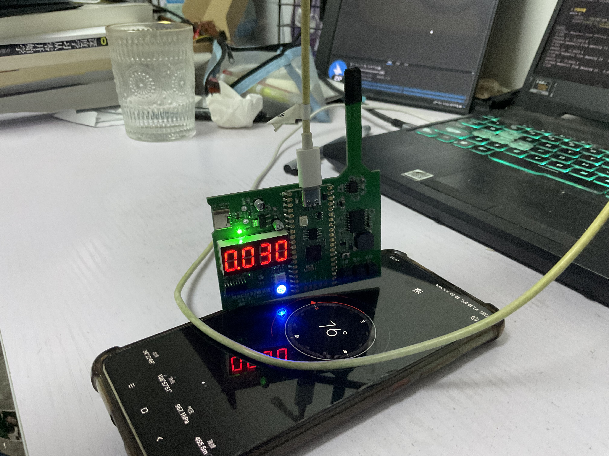
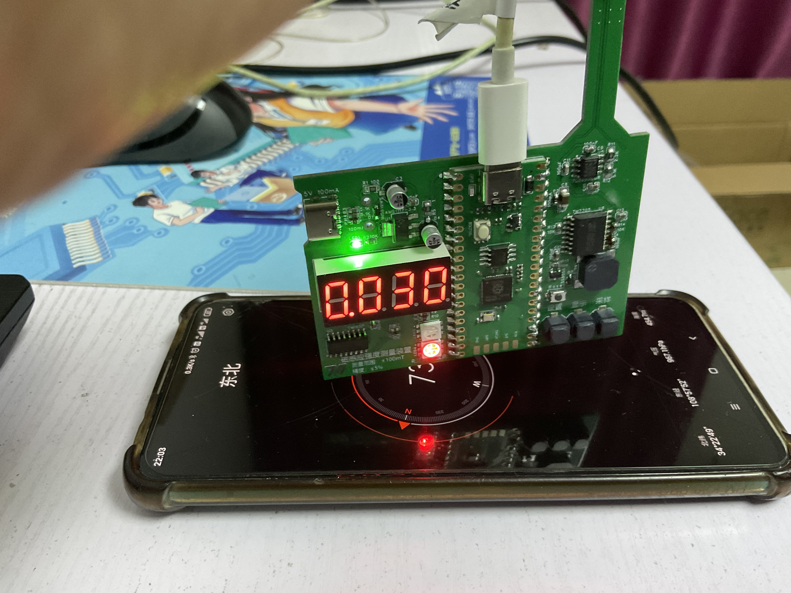

# Tesla-Meter
A simple toy that can measure the strength of magnetic field

一个用于测量磁感应强度的小玩意

## Introduction 介绍
To estimate the magnetic field strength of a coil, I designed this magnetic induction intensity measurement device. It can measure magnetic induction strengths ranging from ±0.01 mT to 100 mT with an accuracy of 5%.

为了估计线圈的磁场强度，我设计了这个磁感应强度测量装置，该装置可以测量±0.01~100mT的磁感应强度，精度5%。

The controller for this magnetic induction measurement device is the RP2040 (Raspberry Pi Pico), programmed with MicroPython. The sensor used is MT9101, a high-precision linear Hall effect sensor IC produced by MagnTek. It can convert the magnetic field strength at the position of the Hall sensor into analog output. For analog-to-digital conversion, I chose the TM7705, a 16-bit sigma-delta ADC manufactured by Titan Micro. The data display consists of a digital display and an RGB LED: the digital display shows the magnetic induction strength, while the RGB LED indicates the direction.

该磁感应测量装置的主控选择RP2040(Raspberry Pi Pico),采用MicroPython开发，传感器采用MT9101，这是一款由MagnTek生产的高精度线性霍尔，能将霍尔片的所处位置的磁感应强度转为模拟量输出。ADC选择使用TM7705，这是一款由天微生产的16位sigma-delta ADC。数据显示采用数码管+RGB LED的组合，数码管显示磁感应强度大小，RGB LED显示方向。

#### Schematic Diagram 原理图

## Working Principle 工作原理
The MT9101 generates varying analog output based on the magnetic flux density in different magnetic fields. When no magnetic field lines pass through the Hall sensor, it outputs 1/2 Vcc. As the magnetic field strength increases, the analog output deviates more from 1/2 Vcc. The direction of deviation also depends on the direction of the magnetic field.

MT9101会在不同的磁场中根据磁通密度的不同产生不同强度的模拟量，无磁感线穿过霍尔片时候输出1/2 Vcc，有磁场时磁场越强，输出的模拟量偏离1/2 Vcc越多；根据磁场的方向不同，其输出偏离1/2 Vcc的方向也不同。

To get precision data, I used an external 16-bit ADC, the TM7705. Due to the architecture of the ADC, this device cannot achieve very high conversion speeds, but it serves its purpose well for measuring Earth’s magnetic field strength.

为了取得更高精度的数据，我在设计电路的时候选择片外的16位ADC TM7705，当然由于ADC架构的问题这个装置无法获得很高的转换速度，但这个玩意能测地磁强度，一切都是值得的。

To determine the output when there is no magnetic field, the device first do zero-calibration by recording the position of 1/2 Vcc. It then compares the measured output with the no-field output, calculating the magnetic field at the measurement location based on the direction and distance of deviation.

该装置为了确定无磁场时的输出，先通过一次校正记录1/2 Vcc的位置，再开始测量，测量得到的结果个无磁场输出做比较，根据偏离的方向和距离计算出测量位置的磁场情况。

## How to Operate 如何操作
1. Connect the power supply.
   连接电源
2. When one of the LEDs starts blinking, place the device flat and press the leftmost button (not the reset button) to initiate zero calibration. Note that during calibration, keep the device away from ferromagnetic objects as much as possible.
   当一颗LED的颜色开始闪烁时平放该装置，按下最左边的按键（不是复位按键）以开始调零。需要注意调零时尽可能让装置远离铁磁性物体
3. Once the device stabilizes and displays a numerical value, it is ready for measurement.
   待装置稳定输出数字时说明该装置开始工作，现在可以开始测量了
4. If you need to recalibrate during measurement, press the corresponding button to start the recalibration process.
   测量途中想要重新调零可以按对应按键开始调零流程

## Working Photos 工作照
### Normal Operation 正常工作

### Measuring Earth’s Magnetic Field 测量地磁场
朝东调零

朝北

朝南

## 碎碎念
1. 这个板子拉线的时候脑抽把输入接反了，幸好TM7705支持双极性输入，只不过损失了一位有效数字
2. 我用的这个RPi Pico是合宙生产的，当时9.9买的，可是现在涨到了19.9，价格翻了一番，还不如原版Pico便宜；FLASH的退耦电容也配的一坨
3. 我感觉程序写的也一坨，但至少能用