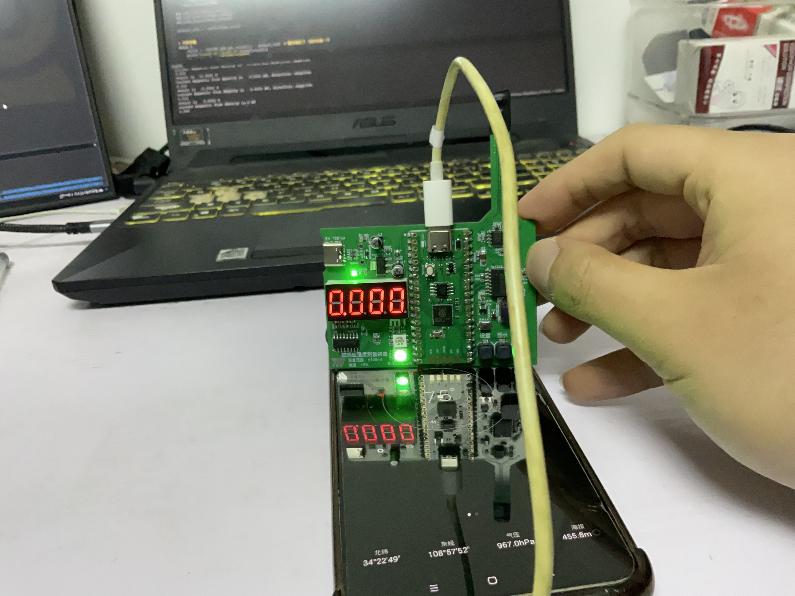

# Tesla-Meter
A simple toy that can measures strength of magnetic field

一个用于测量磁感应强度的小玩意

## 介绍
为了估计线圈的磁场强度，我设计了这个磁感应强度测量装置，该装置可以测量±0.01~100mT的磁感应强度，精度5%。

该磁感应测量装置的主控选择RP2040(Raspberry Pi Pico),采用Micropython开发，传感器采用MT9101，这是一款由MagnTek生产的高精度线性霍尔，能将霍尔片的所处位置的磁感应强度转为模拟量输出。ADC选择使用TM7705，这是一款由天微生产的16位sigma-delta ADC。数据显示采用数码管+RGB LED的组合，数码管显示磁感应强度大小，RGB LED显示方向

#### 原理图

## 工作原理
MT9101会在不同的磁场中根据磁通密度的不同产生不同强度的模拟量，无磁感线穿过霍尔片时候输出1/2 Vcc，有磁场时磁场越强，输出的模拟量偏离1/2 Vcc越多；根据磁场的方向不同，其输出偏离1/2 Vcc的方向也不同。

为了取得更高精度的数据，我在设计电路的时候选择片外的16位ADC TM7705，当然由于ADC架构的问题这个装置无法获得很高的转换速度，但这个玩意能测地磁强度，一切都是值得的。

该装置为了确定无磁场时的输出，先通过一次校正记录1/2 Vcc的位置，再开始测量，测量得到的结果个无磁场输出做比较，根据偏离的方向和距离计算出测量位置的磁场情况。

## 如何操作
1. 连接电源
2. 当一颗LED的颜色开始闪烁时平放该装置，按下最左边的按键（不是复位按键）以开始调零。需要注意调零时尽可能让装置远离铁磁性物体。
3. 待装置稳定输出数字时说明该装置开始工作，现在可以开始测量了
4. 测量途中想要重新调零可以按对应按键开始调零流程。

## 工作照
### 正常工作

### 测量地磁场
朝东调零

朝北

朝南

## 碎碎念
1. 这个板子拉线的时候脑抽把输入接反了，幸好TM7705支持双极性输入，只不过损失了一位有效数字
2. 我用的这个RPi Pico是合宙生产的，当时9.9买的，可是现在涨到了19.9，价格翻了一番，还不如原版Pico便宜；FLASH的退耦电容也配的一坨
3. 我感觉程序写的也一坨，但至少能用